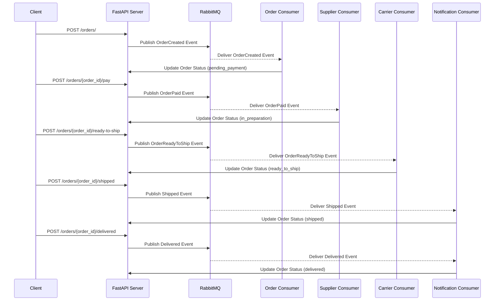

# Order Processing System Documentation

## Overview

The system follows a comprehensive order processing flow with several key stages:

### 1. Order Creation
- **Endpoint:** `POST /orders/`
- **Event Published:** `OrderCreated`
- **Dispatcher Action:** Invokes `handle_order_created` which updates the order status to **pending_payment** and notifies the customer.

### 2. Payment Simulation
- **Endpoint:** `POST /orders/{order_id}/pay`
- **Event Published:** `OrderPaid`
- **Dispatcher Action:** Invokes `handle_order_payed` which updates the order status to **in_preparation** and sends a notification to the supplier to prepare the package.

### 3. Ready-to-Ship Transition
- **Endpoint:** `POST /orders/{order_id}/ready-to-ship`
- **Event Published:** `OrderReadyToShip`
- **Dispatcher Action:** Invokes `handle_order_ready_to_ship` which updates the order status to **ready_to_ship** and notifies the carrier for package pickup.

### 4. Shipping Process
- **Endpoint:** `POST /orders/{order_id}/shipped`
- **Event Published:** `Shipped`
- **Dispatcher Action:** Invokes `handle_shipped` which updates the order status to **shipped** and notifies the customer that the package is on its way.

### 5. Delivery Confirmation
- **Endpoint:** `POST /orders/{order_id}/delivered`
- **Event Published:** `Delivered`
- **Dispatcher Action:** Invokes `handle_delivered` which updates the order status to **delivered** and notifies the customer that the package has been delivered.

## Key Components

### Endpoints
Each endpoint performs the following actions:
- Validates the current state of the order
- Updates the order's status in the database
- Publishes a corresponding event (with a timestamp and order ID) to RabbitMQ using the `EventPublisher`

### Dispatcher
A centralized dispatcher (see `app/events/event_dispatcher.py`) maps event types to handler functions. When an event is received (via a common consumer callback), the dispatcher invokes the appropriate handler.

### Handlers
Handlers (implemented in `app/events/handlers.py`) contain the business logic for each event:
- **handle_order_created:** Updates order status to *pending_payment* and notifies the customer
- **handle_order_payed:** Updates order status to *in_preparation* and notifies the supplier
- **handle_order_ready_to_ship:** Updates order status to *ready_to_ship* and notifies the carrier
- **handle_shipped:** Updates order status to *shipped* and notifies the customer
- **handle_delivered:** Updates order status to *delivered* and notifies the customer

### Consumers
Consumers extend a common base (see `app/events/base_consumer.py"), which handles:
- Connection to RabbitMQ
- Queue declaration
- Retries

They use a generic callback (`consumer_callback`) to decode messages and pass them to the dispatcher.

### Order Processing System Architecture
# Order Processing System Documentation

## System Architecture

