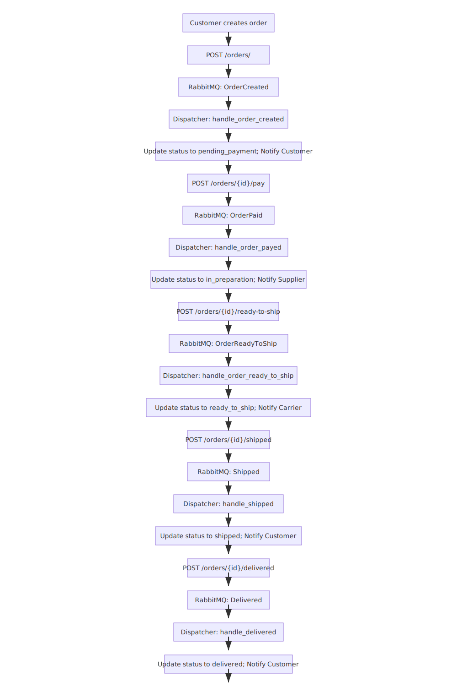

# System Architecture

This document explains the architecture of the Real-Time Order Processing System.

## Deployment Options

The system can be deployed using either Docker Compose or Kubernetes:

- **Docker Compose**: Suitable for development and small deployments
- **Kubernetes**: Recommended for production and scalable deployments

## Overview Diagram (Kubernetes Deployment)

```
┌───────────────────────────────────────────────────────────┐
│                      CLIENT APPLICATIONS                  │
└───────────────┬───────────────────────────┬───────────────┘
                │                           │
                ▼                           ▼
┌───────────────────────────┐   ┌───────────────────────────┐
│      INGRESS CONTROLLER   │   │      ADMIN DASHBOARD      │
└───────────────┬───────────┘   └───────────────────────────┘
                │
                ▼
┌───────────────────────────────────────────────────────────┐
│                    KUBERNETES CLUSTER                     │
├───────────────────────────────────────────────────────────┤
│                                                           │
│   ┌─────────────┐    ┌─────────────┐    ┌─────────────┐   │
│   │  FastAPI    │    │   RabbitMQ  │    │  Consumers  │   │
│   │ Deployment  │◄──►│  Deployment │◄──►│ Deployment  │   │
│   │ (replicas=3)│    │             │    │ (replicas=2)│   │
│   └─────────────┘    └─────────────┘    └─────────────┘   │
│          │                  │                 │           │
│          │                  │                 │           │
│   ┌─────────────┐    ┌─────────────┐    ┌─────────────┐   │
│   │ PostgreSQL  │    │    Redis    │    │ Monitoring  │   │
│   │  StatefulSet│    │ Deployment  │    │ Deployment  │   │
│   │             │    │             │    │             │   │
│   └─────────────┘    └─────────────┘    └─────────────┘   │
│                                                           │
└───────────────────────────────────────────────────────────┘
```

## Kubernetes Components

### Deployments

- **FastAPI Deployment**: Handles HTTP requests, validates data, and publishes events
  - Horizontally scalable with multiple replicas
  - Exposed via Service and Ingress resources

- **RabbitMQ Deployment**: Central event bus for the system
  - Configured with persistence for message durability
  - Exposed internally for service communication

- **Consumer Deployment**: Processes events from RabbitMQ
  - Horizontally scalable based on event volume
  - Implements business logic for all event types

- **PostgreSQL StatefulSet**: Persistent data storage
  - Uses persistent volumes for data durability
  - Configured with appropriate backup mechanisms

- **Redis Deployment**: High-speed caching layer
  - Used for product information, rate limiting, and session data
  - Configured for high availability in production

- **Monitoring Deployment**: Collects and exposes metrics
  - Prometheus for metrics collection
  - Grafana for visualization
  - Alerts configured for critical issues

### Services

- **FastAPI Service**: Exposes the API to external clients
  - NodePort or LoadBalancer type for external access
  - Internal ClusterIP for internal communication

- **RabbitMQ Service**: Internal service for message broker
  - Management UI exposed selectively for administration

- **PostgreSQL Service**: Internal service for database access

- **Redis Service**: Internal service for cache access

### ConfigMaps and Secrets

- **Environment ConfigMap**: Stores non-sensitive configuration
  - API settings
  - Feature flags
  - Connection parameters

- **Secrets**: Stores sensitive information
  - Database credentials
  - RabbitMQ credentials
  - API keys for external services

## Component Descriptions

### FastAPI Service

The FastAPI service handles all HTTP requests from clients. It:
- Validates incoming requests
- Publishes events to RabbitMQ
- Queries the database when needed
- Uses Redis for caching frequently accessed data

### RabbitMQ Message Broker

RabbitMQ serves as the central event bus, enabling:
- Asynchronous processing of orders
- Decoupling of services
- Message persistence for reliability
- Retry mechanisms for handling transient failures

### Consumer Service

The Consumer service processes events from RabbitMQ. It:
- Handles business logic for each event type
- Updates the database based on event data
- Publishes subsequent events when needed
- Implements retry logic for resilience

### PostgreSQL Database

PostgreSQL stores all persistent data including:
- Orders and their statuses
- Products and inventory
- Customer information
- Transaction history

### Redis Cache

Redis provides high-speed caching for:
- Product information
- Rate limiting data
- Session management
- Temporary operational data

### Monitoring Service

The Monitoring service tracks system health and performance:
- Collects metrics from all services
- Exposes Prometheus endpoints
- Provides real-time system visibility
- Facilitates alerting for critical issues

## Event Flow

The system implements a complete event flow for order processing:

1. Order Created → Initial order placement
2. Payment Initiated → Begin payment processing
3. Payment Processed → Payment confirmation
4. Order Paid → Update order status to paid
5. Inventory Checked → Verify product availability
6. Order Prepared → Ready for shipping
7. Order Shipped → Shipping information recorded
8. Order Delivered → Final delivery confirmation

## Event Diagram

  

## Scaling Considerations

The Kubernetes architecture provides several scaling advantages:

- **Horizontal Pod Autoscaling**: Automatically scales pods based on CPU/memory usage
- **StatefulSets for Databases**: Ensures proper database scaling and data integrity
- **Resource Quotas**: Prevents resource starvation in multi-tenant clusters
- **Node Autoscaling**: Automatically adjusts cluster size based on demand (cloud deployments)

## Resilience Features

- **Pod Disruption Budgets**: Ensure minimum availability during maintenance
- **Liveness and Readiness Probes**: Detect and recover from application failures
- **Automatic Pod Restarts**: Recover from transient failures
- **Rolling Updates**: Zero-downtime deployments
- **Message persistence in RabbitMQ**: Ensures no messages are lost
- **Database transaction management**: Maintains data integrity